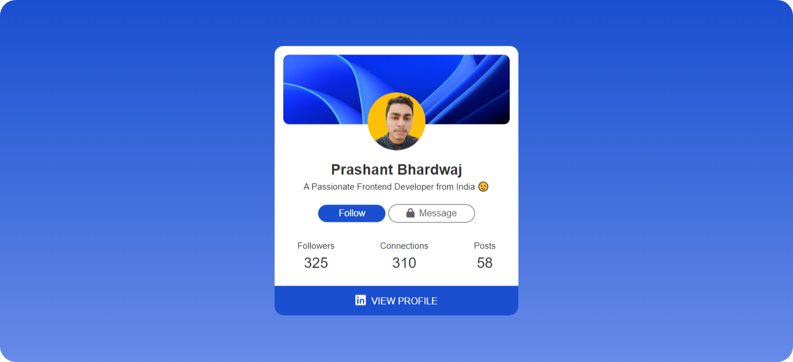

<div align="center">
  
  
  
  
 
  <br />

  <h2 align="center">LinkedIn Profile Card</h2>

  In this project, I have created LinkedIn Profile Card, The project is built using HTML & CSS.

  <a href="https://geeky-prashant.github.io/linkedin-profile-card/"><strong>➥ Live Demo</strong></a>

</div>

### Demo Screeshots



### Prerequisites

Before you begin, ensure you have met the following requirements:

* [Git](https://git-scm.com/downloads "Download Git") must be installed on your operating system.

### Run Locally

To run **linkedin-profile-card** locally, run this command on your git bash:

Linux and macOS:

```bash
sudo git clone https://github.com/geeky-prashant/linkedin-profile-card.git
```

Windows:

```bash
git clone https://github.com/geeky-prashant/linkedin-profile-card.git
```

### Contact

If you want to contact me you can reach me at [Twitter](https://www.twitter.com/geekyprashant).

### License

This project is **free to use** and does not contains any license.
